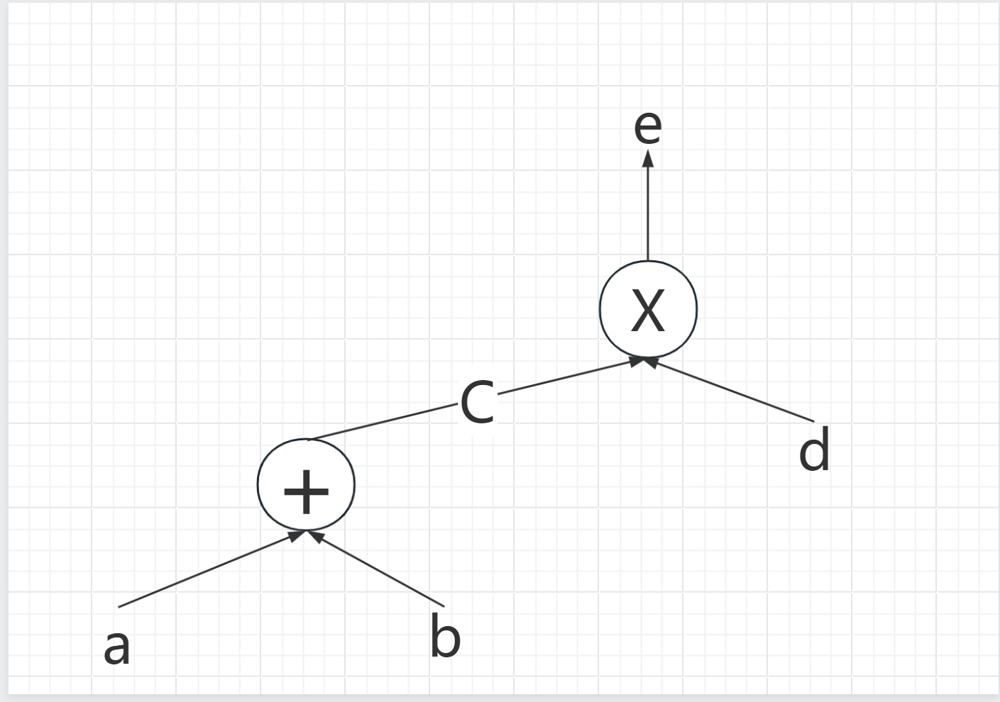

## Halo2

**Halo2** 是一种用于开发零知识证明电路的工具，基于Plonk底层算法和电路构造模式，同时扩展自定义门(custom gate)，和lookup (AKA UltraPLONK)

halo2电路书写形式与其他不同（如bellman），采用**`table`**或**`matrix`**组织定义不同属性值。是根据值的矩形矩阵定义的。使用传统的含义来表示该**`矩阵的行、列和单元格`**。

无需设置setup (使用嵌套均摊)

以下是使用 **Halo2** 开发电路的一些步骤和工具：

1. **Halo2 电路系统**：
   - **Halo2** 的电路系统是由表（matrix/table）定义的，使用行（rows）、列（columns）和单元格（cells）来表示各种不同的意义。
   - **电路的配置**
     - **有限域 F**，其中**cell** (单元格) 值，是F的元素，使用**`Pasta`** 曲线域. 
     - 数据存放在**Table**  中，列有以下几种：
       -  **advice 列（代表 witness）** ，电路中的秘密输入
       - **instance 列（代表 public input   PI）**，`Prover` 和 ` validator` 间共享值。
       - **fixed  列** 作为常量(constant) 使用，plonk paper 中的 q 电路的一部分。  
       - **selector 列**  辅助字段，用于**确定激活门的条件**，在halo2 中作为Fixed列的一种特殊情况，只能取**0,1**
     - **Copy constrain** 作用在两个或者以上不同的Cell 上。
     - **lookup** & **多项式约束**： 约束可以当前行的给定列的cell 值，也可以是该行相对的另一行的给定列。 即 **一个门中的多项式约束**可以**引用多行多列值**。
     - **custom gate**: 表达式多元高次多项式，最高此数可以超过2，每一个custom gate 都有一个对应的selector column 相对应。custom gate 只能引用偏移的**Cell**，偏移值类型是 Rotation。
2. **使用 Mock Prover 进行调试**：
   - **Mock Prover** 是一个用于调试电路的工具，可以在单元测试中，将电路中的每个约束都测试一遍。(halo2_proofs::dev::MockProver)
   - 如果某个约束不满足，则会报错，否则正常返回。
3. **可视化电路**：
   - 使用 **circuit_layout** 工具，可以以图表的形式展示电路的不同部分，例如 advice、fixed 和 instance。
4. **计算电路消耗**：
   - 使用 **cost-model** 工具，可以计算电路生成的证明大小以及验证所需的时间。
5. **电路开发示例**：
   - 假设我们要开发一个电路，其中 a 和 b 是私有输入，c 是公共输入，要证明 a^2 * b^2 = c。
   - 需要定义 instructions 来处理乘法操作，以及相应的 chip 实现。
6. **构造电路**：
   - 使用 **circuit trait**，定义自己的电路结构并接入 witness 输入。
   - 需要实现 configure、synthesize 等函数。

如图构造了一个简单的电路描述，包含两个约束

- a + b =c 
- c * d = e

构造的表如下

| advice | advice | advice | selector(add) | selector(mul) |
| ------ | ------ | ------ | ------------- | ------------- |
| a      | b      | c      | 1             |               |
| c      | d      | e      | 0             | 1             |

表中两行分别表示了上述两个约束方程，第一行满足 a + b - c = 0 ， 第二行满足 c * d - e = 0 . 其中还隐含了一个复制约束，column [2] [0] = column [0] [1]

#### keyword

1. Chip：电路由多个Chip逻辑组成，每个Chip的创建是从`config` 开始的。 小的逻辑单元。
2. Config：申请Chip需要的Column以及配置Fixed列的逻辑含义。这些配置可能是Custom Gate，可能是lookup。
3. Instructions：每一个Chip都有指令（Instruction）。通过指令的调用，将Chip的部分或者全部功能加入电路中。
4. Layouter：将Chip添加到一个电路上需要布局。Layouter就是用来实现布局。
   - Layouter本身存在层级关系，所以Layouter的接口定义了 `get_root` `push_namespace` `pop_namespace` `namespace`等方法，核心逻辑在其他三个函数：
     - `assign_region`: 获取一个region，在其之上进行各种`assignment` (任务)，定义在`RegionLayouter`接口中。
     - `assign_table` : 获取一个table，并设置table，接口定义在`TableLayouter`接口中。
     - `constrain_instance`: 限制一个`Cell` 和`instance`列中的某个`Cell`一致。
5. **Assginment** ：Assignment是一个电路“赋值”的接口。电路的实际赋值

**ConstrainSystem**: 电路的静态约束（电路本身的约束关系） ，在其他zk项目中，则是包含电路的所有信息。

### **Permutation**

Copy/Equal constraint  

集合从自身到自身的一个映射。 按照某种规则把集合中的元素组合成自生元素的重新排序。

理解Halo2，可以从两部分着手：

- 电路构建。 
- 证明系统。

从开发者的角度看，**电路构建是接口**。如何通过Halo2创建电路，这些电路在Halo2的内部如何表示是理解电路构建的关键。**Halo2中的Chip电路由一个个Region组成**，在Halo2的框架中，**Region通过Layouter进行分配**。电路的**所有的信息都存储**在**`Assignment`**的接口中。

Halo2的电路构建分为两部分：

- Configure （电路配置）
  - 申请advice 、instance、 fixed、 columns
  - 定义custom gate
  - 定义lookup （input expression 、 table expression） 

- Synthesize（电路综合）
  - 分配region
  - 给region 中的变量赋值
    - `assign_advice`
    - `assign_advice_from_constant`
    - `assign_advice_from_instance`
    - `assign_fixed`  
    - path: halo2_proofs/src/circuits.rs

简单的说，**Configure就是进行电路本身的配置**。**Synthesize进行某个电路实例的综合。**

