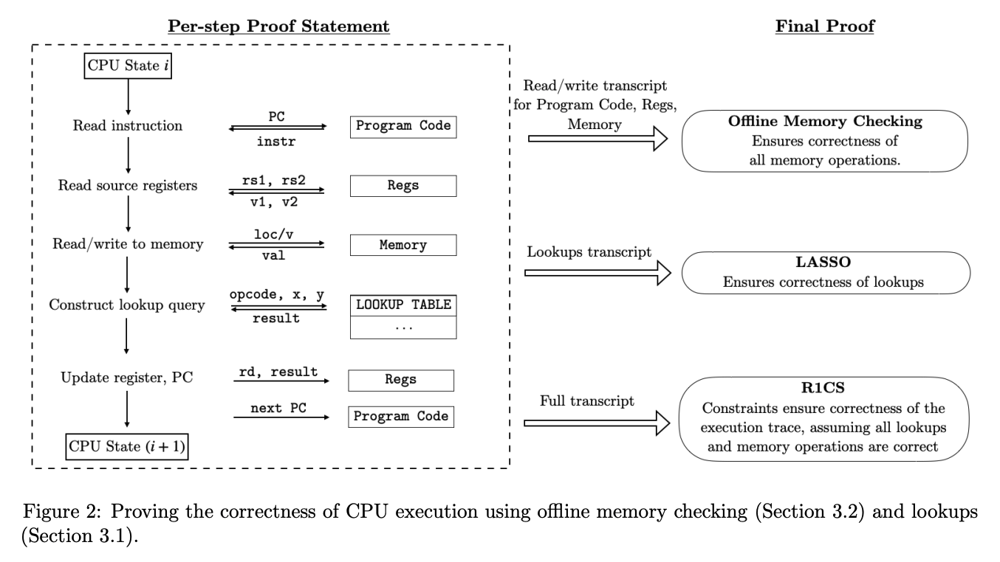
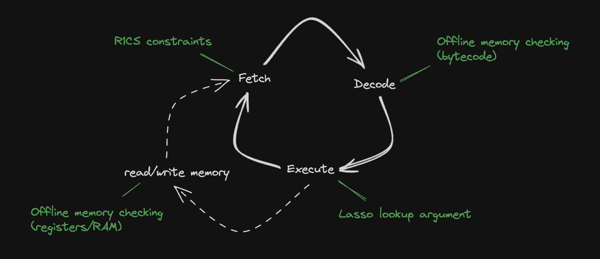
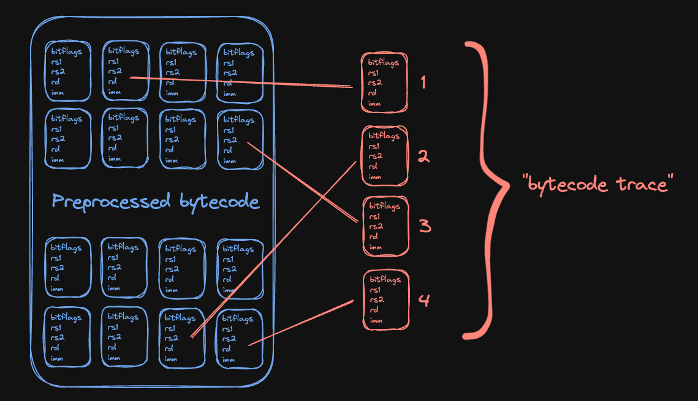

## Jolt —— zksnark zkvm

 https://github.com/a16z/jolt 

[FAQ on Jolt’s initial implementation - a16z crypto](https://a16zcrypto.com/posts/article/faqs-on-jolts-initial-implementation/#section--1)

Jolt （Just *O*ne *L*ookup *T*able）是一种新的前端，由 Lasso 使用超大的查找表的能力解锁。 Jolt 的目标是虚拟机/CPU 抽象，也称为指令集架构，支持这种抽象的 SNARK 称为 zkVM。 仅需要 50-100 个 LOC 即可实现新的 VM 指令。

Jolt 代码库目前针对大多数高级语言编译器支持的 RISC-V 指令集，但该代码旨在可扩展并可供任何 ISA 使用。

> Jolt 要求的 ISA 的唯一属性是每个原始指令都是“可分解的”。这意味着可以通过以下形式的过程来评估一个或两个 32 位或 64 位输入上的指令。将每个输入分解为 8 位块，将一个或多个指定函数应用于这些块（每个输入一个），并根据对块进行操作的函数的输出重建原始指令的输出。

相比于sp1的话，感觉开发更加的简洁，至于底层用到的zk算法暂时并未涉猎。

Env setup

```shell
cargo +nightly install --git https://github.com/a16z/jolt --force --bins jolt

jolt install-toolchain


jolt new project
cd project
cargo run --release
```

Project  construct 

```rust
total 128
-rw-r--r--  1 scc  staff  53760  4 18 10:09 Cargo.lock
-rw-r--r--  1 scc  staff    606  4 18 10:08 Cargo.toml
drwxr-xr-x  4 scc  staff    128  4 18 10:08 guest
-rw-r--r--  1 scc  staff     83  4 18 10:08 rust-toolchain.toml
drwxr-xr-x  3 scc  staff     96  4 18 10:11 src
drwxr-xr-x@ 6 scc  staff    192  4 18 13:24 target
```

* guset：guest中包含了Jolt 需要证明的程序。这些函数必须使用 no_std Rust 编写。如果有一个不需要标准库的函数，那么使其可证明就像确保它位于来`guest`内并在其上方添加 `jolt::provable` 宏。

  ```rust
  #![cfg_attr(feature = "guest", no_std)]
  #![no_main]
  
  #[jolt::provable]
  fn add(x: u32, y: u32) -> u32 {
      x + y
  }
  
  #[jolt::provable]
  fn mul(x: u32, y: u32) -> u32 {
      x * y
  }
  ```

  * 由于jolt 并不完全兼容rust标准库，但提供了支持诸如 Vec/Box 之类的数据结构，引入方式。

    ```rust
    #![cfg_attr(feature = "guest", no_std)]
    #![no_main]
    extern crate alloc;
    use alloc::vec::Vec;
    
    #[jolt::proable]
    fn alloc (n:u32)-> u32{
      let mut v  = vec::<u32>::();
      for i in 0..=n{
        v.push(i);
      }
      v[(n-1) as usize]
    }
    ```

  

  * Jolt 为`总分配内存`和`堆栈`大小提供合理的`默认值`。然而，默认值可能不够，导致我们的跟踪器中出现不可预测的错误。为了解决这个问题，我们可以尝试`增加这些大小`。我们建议首先从`堆栈大小`开始，因为这更有可能耗尽。

    ```rust
    #[jolt::provable(stack_size = 10000, memory_size = 10000000)]
    fn alloc (n:u32)->u32{
      todo()!
    }
    ```

  * max input size && output size 默认情况下，Jolt 将输入和输出的大小限制为 `4096` 字节。使用超过此大小的输入和输出将导致错误。这些值可以通过宏进行配置。

    ```rust
    // jolt-sdk/macro/lib.rs 中定义了provable 可设置的属性。
    struct Attributes {
        memory_size: u64,
        stack_size: u64,
        max_input_size: u64,
        max_output_size: u64,
    }
    ```

    

    ```rust
    #[jolt::provable(max_input_size = 10000, max_output_size = 10000)]
    ```

  * 有时，在安装工具链后，Jolt仍然尝试使用标准库进行编译，这将失败并出现大量错误，即某些项目（例如结果）被引用且不可用。在安装工具链之前尝试运行 jolt 时，通常会发生这种情况。要解决此问题，请尝试重新运行 jolt install-toolchain，重新启动终端，然后删除 rust 目标目录以及 /tmp 下以 jolt 开头的任何文件。

* Src 下则涵盖了 对guest中程序的编译，调用、验证 。

### Jolt components
Jolt VM 职责：
* 重复执行其指令集架构的 fetch-decode-execute。
* 对随机存取存储器 (RAM) 执行读取和写入操作。

  

Jolt 代码库的组织方式类似，但将读写存储器（包括寄存器和 RAM）与程序代码（又名字节码，只读）分开，总共有四个组件：




* Read-Write memory : 为了处理对 RAM（和寄存器）的读/写，Jolt 使用来自 Spice 的内存检查参数，该参数与 Lasso 本身密切相关。它们都基于“离线内存检查”技术，主要区别在于 Lasso 支持只读内存，而 Spice 支持读写内存，因此价格稍贵。 

  * Jolt 使用离线内存检查来证明寄存器和 RAM 的有效性。与我们在其他模块中使用离线内存检查不同，寄存器和 `RAM 是可写内存`。

  * 出于离线内存检查的目的，Jolt 将`寄存器、程序输入/输出`和 `RAM` 视为占用一个`统一的地址空间`。重新映射的地址空间布局如下:

  * 如上所示的零填充是为了让RAM从一个二的幂偏移量开始。如图所示，witness 的大小会随着程序执行过程中地址最高的内存而变化。除了在“程序I/O”和“RAM”部分之间的零填充之外，witness的末尾还会填充到二的幂。

  * Program IO:

    * 程序输入和输出（以及恐慌位，指示程序是否恐慌）与 RAM 位于同一内存地址空间中。程序输入在初始化时填充指定的输入空间, 验证者可以自行有效地计算该初始内存状态的 MLE（即与 IO 大小成比例的时间，而不是总内存大小）。

    * 另一方面，验证程序无法独自计算最终内存状态的MLE——尽管程序 I/O 已知于验证程序，但最终内存状态包含在程序执行过程中写入寄存器/RAM 的值，这些值验证程序并不知道。然而，验证程序能够计算程序 I/O 值的 MLE（两侧填充零） - 如下所示为 v_io。如果证明者诚实，那么最终的内存状态（如下面的 v_final）应在与程序 I/O 对应的索引处与 v_io 相符。 为了强制执行此操作，调用 sumcheck 协议对 v_final 和 v_io 之间的差异执行“零检查”。

      这也激励了在“程序I/O”和“RAM”部分之间进行零填充。零填充确保input_start和ram_witness_offset都是2的幂，这使得验证器更容易计算v_init和v_io的MLE。

    * TimeStamp range check:  确保读值的正确性，验证每个读取操作是否检索在上一步（而不是未来步骤）中写入的值。断言每个读取操作的时间戳（表示为 read_timestamp）不得超过该特定步骤的全局时间戳。全局时间戳从 0 开始，每一步递增一次。验证read_timestamp≤global_timestamp相当于确认read_timestamp落在[0,TRACE_LENGTH)范围内，并且差值`(global_timestamp−read_timestamp)`也在同一范围内。确保 read_timestamp 和 `(global_timestamp−read_timestamp)` 都位于指定范围内的过程称为范围检查。这是在 `timestamp_range_check.rs `中使用 Lasso 的修改版本实现的过程。

* R1CS : `fetch-decode-execute `中的 `fetch`部分  (RISC-V VM 的每个周期大约有 60 个约束）。这些约束处理程序计数器 (PC) 更新,强制下面组件中使用的多项式之间的一致性。 Jolt 使用[Spartan](https://eprint.iacr.org/2019/550)，针对约束系统的高度结构化性质进行了优化（例如，R1CS 约束矩阵是块对角矩阵，块大小仅为约 60 x 80）。这是在[jolt-core/src/r1cs](https://jolt.a16zcrypto.com/jolt-core/src/r1cs/)中实现的。

  * Jolt 使用 R1CS 约束来强制执行 RISC-V `fetch-decode-exectue`循环的某些规则，并确保 Jolt 不同模块（指令查找、读写内存和字节码）的证明之间的一致性。
  * Jolt 的 R1CS 是`uniform` (统一的)，这意味着整个程序的约束矩阵只是`单个 CPU 步骤的约束矩阵的重复副本`。每个步骤在概念上都很简单，涉及大约 60 个约束和 80 个变量。
  * 单个 CPU 步骤的约束系统所需的输入为：
    * Pertaining to bytecode:	
      * PC: 这是 CPU 步骤之间传递的唯一状态。
      * bytecode read address: 这一步读取的程序代码中的地址。
      * 指令的预处理（“5 元组”）表示: `bitflags`, `rs1`, `rs2`, `rd`, `imm`

    * pertaining to read-write memory: 
      * 指令读取的（起始）RAM 地址：如果指令不是加载/存储，则为 0。
      * 写入内存或从内存读取的字节。

    * pertaining to instruction lookup :
      * 指令操作数 x 和 y 的块。
      * 查找查询的块。这些通常是操作数块的某种组合
      * lookup output
  * Circuit and instruction flags:
    * 有九个电路标志用于指导约束，并且仅依赖于指令的操作码。因此，它们作为预处理字节码的一部分存储在 Jolt 中
      * `operand_x_flag`: 0 if the first operand is the value in rs1 or the PC.
      * `operand_y_flag`: 0 if the second operand is the value in rs2 or the imm.
      * `is_load_instr`
      * `is_store_instr`
      * `is_jump_instr`
      * `is_branch_instr`
      * `if_update_rd_with_lookup_output`: 1 if the lookup output is to be stored in rd at the end of the step.
      * `sign_imm_flag`: used in load/store and branch instructions where the instruction is added as constraints
      * `is_conact`: indicates whether the instruction performs a concat-type lookup.
  * 指令标志：这些是用于指示在给定步骤执行指令的一元位。每步的数量与 Jolt 中唯一指令查找表的数量一样多，即 19 个。
  * `Constraint system`: CPU 步骤的约束在 get_jolt_matrices() 函数中
  * `Reusing commitments`: 与大多数SNARK后端一样，Spartan需要计算对约束系统输入的承诺。Jolt中的一个技巧，`大多数输入也用作其他模块中证明的输入`。例如，与字节码相关的地址和值在字节码内存检查证明中使用，查找块、输出和标志在指令查找证明中使用。为了保证Jolt的正确性，必须确保相同的输入被提供给所有相关证明。通过重新使用承诺本身来实现这一点。这可以在r1cs/snark模块中的format_commitments()函数中看到。Spartan被调整为接受预提交的见证变量。
  * `uniform`:
    * Spartan 被修改为仅接受单个步骤的约束矩阵以及步骤总数。使用它，证明者和验证者可以有效地计算完整 R1CS 矩阵的多线性扩展。
    * witness 的承诺格式已更改以反映一致性。与每个时间步对应的变量的所有版本都一起提交。这会影响 Jolt 中提交的几乎所有变量。
    * input && witness 作为片段提供给约束系统。
    * 附加约束用于强制 CPU 步骤之间传输的状态的一致性。

* ###### Instruction lookup ： `execute`部分。Jolt 调用 Lasso 查找参数。查找参数将每条指令（包括其操作数）映射到其输出。这是在instruction_lookups.rs 中实现的。

* Bytecode `decode`  Jolt 使用另一个（只读）离线内存检查实例，类似于 Lasso。客户程序的字节码在预处理中被“解码”，并且证明者随后对与被证明的执行跟踪相对应的该解码的字节码的读取序列调用离线存储器检查。这是在 bytecode.rs 中实现的。

  * 跟踪器迭代程序 ELF 文件的 .text 部分并解码 RISC-V 指令。每条指令都映射到 BytecodeRow 结构：

    ```rust
    #[derive(Debug, Clone, PartialEq, Serialize, Deserialize)]
    pub struct BytecodeRow {
        /// Memory address as read from the ELF.
        address: usize,
        /// Packed instruction/circuit flags, used for r1cs
        bitflags: u64,
        /// Index of the destination register for this instruction (0 if register is unused).
        rd: u64,
        /// Index of the first source register for this instruction (0 if register is unused).
        rs1: u64,
        /// Index of the second source register for this instruction (0 if register is unused).
        rs2: u64,
        /// "Immediate" value for this instruction (0 if unused).
        imm: u64,
    }
    ```

    RISC-V 规范中描述了寄存器rd rs1 rs2 imm.。预处理的字节码充当（只读）“内存”，我们在其上执行离线内存检查。

  * Bitflags 给定指令的位标志是其电路标志和指令标志的串联。这种串联是由 R1CS 约束强制执行的。


### Instruction Lookup 

在 Jolt 中，“fetch-decode-execute”循环的“execute”部分是使用查找参数 (Lasso) 来处理的。在高层次上，查找查询是指令操作数，lookup outputs are the instruction outputs.

#### Lasso 

Lasso 是一个查找参数（相当于read read-only memory的 SNARK）。

查找参数允许证明者让验证者相信对于已提交的值向量 `v` ,索引 `a` 的提交向量和查找表 `T`
$$
T[ai]=vi
$$
Lasso 是一种特殊的查找参数，具有非常理想的渐近成本，很大程度上与查找次数（向量 a 和 v 的长度）相关，而不是与表 T 的长度相关。这允许每个 VM 指令的证明者算法的成本/开发人员复杂性保持不变。

> 通过对大量结构化表执行查找来避免繁琐的手动优化电路，从而减少浪费。
>
> 查找参数不是通过加法和乘法直接计算按位指令，而是在所有可能的输入上*预先计算*按位指令的输出。然后，zkVM 应用相对便宜的 SNARK 操作（又称“查找”）来验证当前指令是否存在于预计算表中。这样做可以降低指导成本。 
>
> 先前的 SNARK 设计方法涉及将 CPU 指令制定为电路并进行手动优化——这是一项低级且安全关键的任务，需要特定领域语言的专业知识。相比之下，不同语言生态系统的开发人员应该能够相对轻松地使用 Lasso。
>
> 在 Lasso 中，一条指令是通过其子表分解来定义的：它的“大”查找表可以由一些较小的“子表”组成。更重要的是，这样的分解可以用高级编程语言简洁地描述。

Lasso 启用了一种对非常大的表（例如涉及 64 位按位运算的2 128大小的表）进行`高效查找`的新策略。与现有的查找方案不同，无论访问多少条目，**成本都不会随着查找表的大小线性增长**。相反，成本主要**随着查找次数的增加而增加**：Lasso 有效地证明了对此表的查找，而**无需将整个表具体化**。 

 [lasso youtube](https://www.youtube.com/watch?v=iDcXj9Vx3zY) 

Lasso需要每个基本指令都满足可分解性属性。所需属性是指令的输入可以被分成`chunk`（比如，chunk包含16位），这样就可以通过在每个块上评估简单函数，然后将结果“整合”在一起来获得对原始指令的答案。例如，两个32位输入x和y的按位或可以通过将每个输入分解为8-bit chunk来计算，将x的每个8位块与y的相关块进行异或运算，然后将结果连接在一起。

* **大[域](https://en.wikipedia.org/wiki/Finite_field)上的 SNARK 是一种浪费。每个人都应该使用 [FRI](https://eccc.weizmann.ac.il/report/2017/134/)、[Ligero](https://eprint.iacr.org/2022/1608)、[Brakedown](https://eprint.iacr.org/2021/1043) 或其变体，因为它们避免了通常适用于大域的椭圆曲线技术。**
* *指令集越简单zkVM越快
  * **只要每条指令的求值表是可分解的，Jolt 的（每条指令）复杂度就仅取决于指令的输入大小。对于更简单的虚拟机，Jolt 为证明者实现了比之前的 SNARK **更低的承诺开销**。

* **将大型计算分解为小片段不会造成性能损失。** 
  * 一些 SNARK（例如 Lasso 和 Jolt）会表现出规模经济（***在微观经济学中是指扩大生产规模引起 经济效益 增加的现象**，是 长期 平均总成本随产量增加而减少的特性。**而不是当前部署的 SNARK 中展现的规模不经济**）。意思是被证明的语句越大，相对于直接证据检查（即在不保证正确性的证据上求值电路所需的工作）的证明者开销越*小*。在技术层面，规模经济来自两个地方。
    * 对n大小的 MSM 的 Pippenger 加速：相对于朴素算法有 log(n) 因子的改进。 n越大，改进越大。
    * 在 Lasso 等lookup论证中，证明者支付“一次性”开销，该开销取决于**查找表的大小，但与查找值的数量无关**。一次性证明者的开销摊销在了对表的所有查找之中。更大的块意味着更多的查找，意味着更好的摊销。
* **高阶约束对高效SNARK是必要的。**
* **稀疏多项式承诺方案成本高昂，应尽可能避免。**
  * Lasso 和 Jolt 的技术核心就是 [Spartan](https://eprint.iacr.org/2019/550) 中的稀疏多项式承诺方案 称为Spark。Spark 本身是将***任何*（非稀疏）多项式承诺方案到支持稀疏多项式的方案的通用转换**。


> 在零知识证明（ZK）中，MSM 是 Multi-Scalar Multiplication（多标量乘法）的缩写.在 ZK 证明生成的过程中，主要耗时的计算可以分为两种类型，一种是基于多项式的 NTT (Number Theoretic Transform)计算，另一种就是在椭圆曲线上进行的 MSM 计算。
>
> MSM 类型的计算任务约占到全部计算任务的 60–70 % 左右这种类型的计算任务存在以下特点
>
> 1. 逻辑相对简单，
> 2. 大量重复相同的计算逻辑，
> 3. 可并行的特点。

> 在Jolt中，Spartan作为**多项式承诺方案**的应用
>
> 多项式承诺方案是SNARKs（简洁非交互式知识论证）中的一个重要组成部分。在SNARKs中，证明者需要使用多项式承诺方案来秘密地提交电路中每个门的值。然后，证明者证明所提交的值确实满足正确的计算过程。将来自多项式承诺方案的证明工作称为承诺开销（**commitment costs**）。
>
> Spartan作为一种多项式承诺方案，其优势在于它可以有效地处理**稀疏多项式**。这对于Jolt来说非常重要，因为在Jolt中，开发者将更容易用他们喜欢的高级语言来编写高效的SNARKs。Lasso引入了一个简化的zkVM设计方法，**通过对大型结构化表执行查找，避免了开发者繁琐地手动优化电路，减少了大量的精力浪费**。而基于Jolt的VM既简单又快速，而且容易被审计。
>
> 总的来说，Spartan作为多项式承诺方案在Jolt中的应用，主要体现在提供了一种高效的方式来处理稀疏多项式，从而使得开发者能够更容易地编写高效的SNARKs


