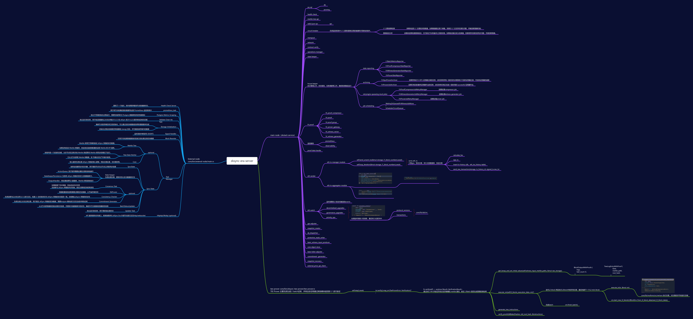

# Project Architecture

## Main Node - crates

### consensus node

bft 共识算法 zksync-era/core/node/consensus，共识层实现则是由 [era-consensus](https://github.com/matter-labs/era-consensus) 这个库实现。

### vm-runner

使用 VM 运行器执行处理逻辑，从 [`VmRunnerIo`] 中提取数据并进行处理。

core/node/vm_runner/src/process.rs >>>async fn  process_batch

协作模块 node/state-keeper (gas 计算，状态更改等)

### block-reverter

回滚 ZKsync Era 节点状态和恢复以太坊上已提交的 L1 batch的功能。

* SendEthTransaction：向以太坊主网发送回滚交易（zksync 部署的合约），以触发 zkSync 区块的回滚。
* RollbackDB ：回滚 zkSync 系统的数据库状态，单独回滚 **Postgres 数据库** 或 **Merkle 树** 或两者同时进行
* ClearFailedL1Transactions： 清除L1失败的消息。

协作模块DB，contracts

### eth-sender

Eth-tx-manager 

Eth-tx-aggregator

### Eth-watch 

ZKsync Era Eth Watcher 组件，从相应的 L1 合约中获取更改。

在内部，Eth Watcher 包含事件处理器，每个处理器提供一个相关tpoic（即字节 32 Solidity 事件选择器），并负责处理相应的事件。 除了事件，处理器还能访问 L1 客户端（查询更多信息）和节点 Postgres（持久化处理结果）。

Eth Watcher 将provess中的topic合并到单个过滤器中，并定期查询 L1 是否有相应的事件。获取的事件按provess进行分区并连续馈送到它们。

## external-node

zksync-era  external node 用来处理节点同步、状态管理、共识以及承诺生成器等功能。

共识算法bft。zksync-era/core/node/consensus/src/en.rs

### state keeper 

负责维持状态更改的模块

### Commitment-generator 

ZKsync Era 承诺生成器组件的实现，根据以太坊主网上 L1 批处理信息，生成相应的 zkSync 证明所需的提交数据。

协作模块boojum

### consistency-checker

zkSync Era 中负责 **一致性检查 (Consistency Check)** 的功能模块。它的作用是对比 zkSync 网络内部的状态和以太坊主网上对应的信息，确保两者之间的一致性。

### Batch-state-updater

zkSync Era 中负责 **批处理状态更新 (Batch Status Updater)** 的功能模块。作用是同步 zkSync 网络的批处理状态信息。

### Db-pruner 

清理过期的区块数据，以减少 zkSync en的存储空间占用。

### Validation-task

异步验证模块

## service 

### Tee-prover

* 可检索有关由序列器执行的批次的数据并在 TEE 中对其进行验证
* 将已验证批次的证明提交回序列器
* 当应用程序启动时，它会在序列器上注册证明，然后循环运行，轮询序列器以获取新job（batch），验证它们，并提交生成的证明

zksync-era TEE-Prover 主要负责生成批次证明，并将这些证明通过其他模块返回到 L1 进行验证。这是 L2 批次处理和最终提交到 L1 验证过程中的关键一步。

### Contract-verifier

**验证智能合约** 的有效性和安全性

* 验证合约编译后的字节码与部署的字节码是否一致，

  ```rust
  if artifacts.bytecode != deployed_bytecode {
              tracing::info!(
                  "Bytecode mismatch req {}, deployed: 0x{}, compiled 0x{}",
                  request.id,
                  hex::encode(deployed_bytecode),
                  hex::encode(artifacts.bytecode)
              );
              return Err(ContractVerifierError::BytecodeMismatch);
          }
  ```

  * 目前支持的是 solc以及 vyper

    * ```rsut
      match request.req.source_code_data.compiler_type() {
                  CompilerType::Solc => Self::compile_zksolc(request, config).await,
                  CompilerType::Vyper => Self::compile_zkvyper(request, config).await,
              }
      ```

      

* 验证构造函数是否一致

  ```rust
   match constructor_args {
              ConstructorArgs::Check(args) => {
                  if request.req.constructor_arguments.0 != args {
                      return Err(ContractVerifierError::IncorrectConstructorArguments);
                  }
              }
              ConstructorArgs::Ignore => {
                  request.req.constructor_arguments = Vec::new().into();
              }
          }
  ```

  

```rust
async fn main()->anyhow::Result<()>{
  
  
  // connection DB
  let pool = ConnectionPool::<Core>::singleton(
        database_secrets
            .master_url()
            .context("Master DB URL is absent")?,
    )
    .build()
    .await
    .unwrap();
  
  
  ... do something...
  tokio::spawn(contract_verifier.run(stop_receiver.clone(), opt.jobs_number)),
  
}
```


