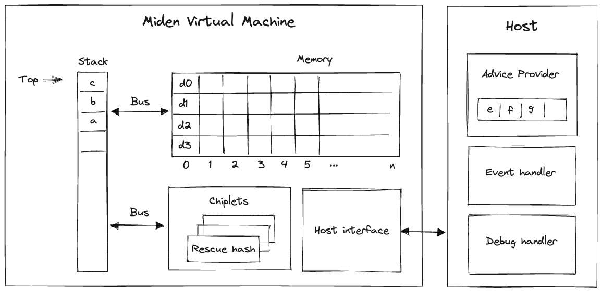

## 简介Miden-vm

一个基于堆栈的stark的 零知识证明的虚拟机



如图所示miden- vm由四个组件组成：

* Stack：这是一个下推堆栈，其中每个项目都是一个字段元素。大多数汇编指令都使用位于堆栈上的值进行操作。堆栈的深度最多可达 2^32 个项目，但只有顶部的 16 个项目可直接访问。
* Memory：是一种线性随机存取读写存储器。 内存是字可寻址的，也就是说，每个地址有四个元素，可以以四个为一组的方式从内存中读取和写入元素。 内存地址范围为 [0,2^32 )。
* Chiplets：是用于加速某些类型计算的专用电路。其中包括 Rescue Prime Optimized (RPO) 哈希函数、32 位二进制运算和 16 位范围检查。
* Host：证明者在运行时与虚拟机通信的一种方式。这包括响应 VM 对非确定性输入的请求以及处理 VM 发送的消息（例如，出于调试目的）。对非确定性输入的请求由主机的建议提供者处理。

但是目前来说miden-vm 可提供的是 汇编代码，Miden 汇编语言是一种简单的低级语言，用于为 Miden VM 编写程序。

### 例：

```shell
begin
    # This code computes 1001st Fibonacci number
    repeat.1000
        swap dup.1 add
    end
end
```

```shell
cd miden-vm && make exec

./target/optimize/miden run -a ./miden/examples/fibo/fibo.masm -n 1
===============================================================================
Run program: ./miden/examples/fib/fib.masm
-------------------------------------------------------------------------------
Executed the program with hash 78d31702eb946e1817e3c0881fcb3739562f08fbddf202de2eae241b9968ab3b in 3 ms
Output: [11112721240812633725]
VM cycles: 3045 extended to 4096 steps (25% padding).
├── Stack rows: 3045
├── Range checker rows: 39
└── Chiplets rows: 337
    ├── Hash chiplet rows: 336
    ├── Bitwise chiplet rows: 0
    ├── Memory chiplet rows: 0
    └── Kernel ROM rows: 0
```


