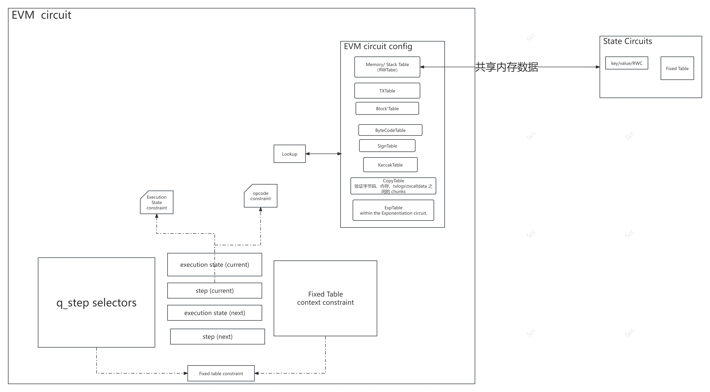
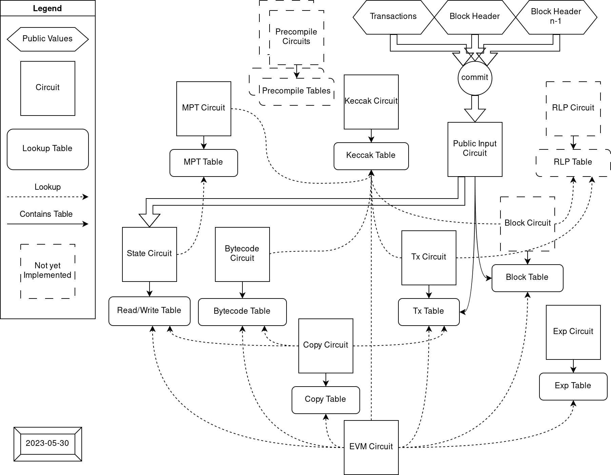

# ZKEVM  by Halo2 implement

https://github.com/privacy-scaling-explorations/zkevm-circuits.git

[zkevm-specs/specs/introduction.md at master · privacy-scaling-explorations/zkevm-specs (github.com)](https://github.com/privacy-scaling-explorations/zkevm-specs/blob/master/specs/introduction.md)

将证明分为两部分：

- **State Proof**：state/memory/stack 都已经正确执行。这不会检查是否已经读取/写入正确的位置。允许证明者在此处选择任何位置，并在EVM证明中确认其正确性。
- **Evm Proof**：这会检查是否在正确的时间调用了正确的操作码。它检查这些操作码的有效性，并确认每个操作码和状态证明都执行了正确的操作。





官方电路示意图




zkevm 总入口，所有电路的上层抽象实例。

```rust
fn synthesize_sub(
        &self,
        config: &Self::Config,
        challenges: &Challenges<Value<F>>,
        layouter: &mut impl Layouter<F>,
    ) -> Result<(), Error> {
        self.keccak_circuit
            .synthesize_sub(&config.keccak_circuit, challenges, layouter)?;
        self.bytecode_circuit
            .synthesize_sub(&config.bytecode_circuit, challenges, layouter)?;
        self.tx_circuit
            .synthesize_sub(&config.tx_circuit, challenges, layouter)?;
        self.state_circuit
            .synthesize_sub(&config.state_circuit, challenges, layouter)?;
        self.copy_circuit
            .synthesize_sub(&config.copy_circuit, challenges, layouter)?;
        self.exp_circuit
            .synthesize_sub(&config.exp_circuit, challenges, layouter)?;
        self.evm_circuit
            .synthesize_sub(&config.evm_circuit, challenges, layouter)?;
        self.pi_circuit
            .synthesize_sub(&config.pi_circuit, challenges, layouter)?;
        Ok(())
    }
```


## State Proof

状态证明帮助 EVM 证明检查所有**随机读写访问记录是否有效**，首先通过将它们按其唯一索引分组，然后按访问顺序（ReadWriteCounter）对它们进行排序。ReadWriteCounter 技术访问记录的数量，也作为记录的唯一标识符。生成状态证明时，还会生成BusMapping，并将作为looKup table 共享给EVM 证明。


### Random Read-Write Data

state proof 维护 EVM 证明的**随机可访问数据的读写部分**。

state proof 中记录的**操作**：

```rust
#[derive(Debug, Clone, PartialEq, Eq, Copy, EnumIter, Hash)]
pub enum Target {
    /// Start is a padding operation.
    Start = 1,
    /// Means the target of the operation is the Memory.
    Memory,
    /// Means the target of the operation is the Stack.
    Stack,
    /// Means the target of the operation is the Storage.
    Storage,
    /// Means the target of the operation is the TxAccessListAccount.
    TxAccessListAccount,
    /// Means the target of the operation is the TxAccessListAccountStorage.
    TxAccessListAccountStorage,
    /// Means the target of the operation is the TxRefund.
    TxRefund,
    /// Means the target of the operation is the Account.
    Account,
    /// Means the target of the operation is the CallContext.
    CallContext,
    /// Means the target of the operation is the TxReceipt.
    TxReceipt,
    /// Means the target of the operation is the TxLog.
    TxLog,
}
```

每个操作使用不同的参数进行索引。

所有表键的串联成为数据的唯一索引。每个记录将附带一个ReadWriteCounter，并且记录被约束为首先按照其唯一索引分组，然后按其ReadWriteCounter递增排序。鉴于对先前记录的访问，每个目标都有自己的格式和规则进行更新

### Circuit Constrains

- Global constraints 影响所有的操作，如keys的顺序
- Particular constraints 每个操作类型都使用类似选择器的表达式，以启用仅适用于该操作的额外约束。

> 对于必须保证数值的正确排序/转换的所有约束条件，使用**相邻单元格之间差值的范围检查**，借助固定查找表。使用查找表来证明正确的排序，对于每个必须排序的列，需要定义它可以包含的**最大值**（这将对应于固定查找表的大小）；这样，顺序排列中的两个相邻单元格将具有表中找到的**差值**，而**逆序排列将使差值环绕到一个非常高的值**（由于字段算术），导致结果不在表中。
>

 

```rust
#[derive(Clone)]
pub struct StateCircuitConfig<F> {
    // Figure out why you get errors when this is Selector.
    selector: Column<Fixed>,
    // https://github.com/privacy-scaling-explorations/zkevm-circuits/issues/407
    rw_table: RwTable,
    sort_keys: SortKeysConfig,
    // Assigned value at the start of the block. For Rw::Account and
    // Rw::AccountStorage rows this is the committed value in the MPT, for
    // others, it is 0.
    initial_value: WordLoHi<Column<Advice>>,
    // For Rw::AccountStorage, identify non-existing if both committed value and
    // new value are zero. Will do lookup for MPTProofType::StorageDoesNotExist if
    // non-existing, otherwise do lookup for MPTProofType::StorageChanged.
    is_non_exist: BatchedIsZeroConfig,
    // Intermediary witness used to reduce mpt lookup expression degree
    mpt_proof_type: Column<Advice>,
    state_root: WordLoHi<Column<Advice>>,
    lexicographic_ordering: LexicographicOrderingConfig,
    not_first_access: Column<Advice>,
    lookups: LookupsConfig,
    // External tables
    mpt_table: MptTable,
    _marker: PhantomData<F>,
}
```

RwTable 中所有账户和存储读写都与MPT电路相关联。在EVM和 state 电路之间共享，其中包含了EVM state operation。 

一般来说，将每个密钥的第一次和最后一次访问（帐户的 [address, field_tag]，存储的 [address, storage_key]）链接到使用链式根的 MPT 证明（证明的 root_next 与下一个证明的 root_previous 匹配） 。最后，将第一个证明的 **root_previous 与 block_previous.root** 进行匹配，将最后一个证明的 **root_next 与 block_next.root** 进行匹配。

>
> 将账户和存储访问与 MPT 证明相关联需要分别处理现有/不存在的情况：EVM 支持读取不存在账户的账户字段和不存在插槽的存储槽；但由于这些值不存在，无法验证 MPT 包含证明。此外，一些 EVM 情况需要明确**验证账户不存在**。在 MPT 方面，通过引**入不存在证明**来解决这个问题。

```rust
// 用于证明RwTable 有效状态
#[derive(Default, Clone, Debug)]
pub struct StateCircuit<F> {
    /// Rw rows   zkevm-circuit/src/witness/rw.rs
    pub rows: Vec<Rw>,  // 用来连接 emv 和 state 电路 
    
    updates: MptUpdates,
    pub(crate) n_rows: usize,
    #[cfg(test)]
    overrides: HashMap<(dev::AdviceColumn, isize), F>,
    _marker: PhantomData<F>,
}
```


## EVM Proof

通过验证块中包含的所有交易是否具有正确的执行结果来证明状态树根的转换是否有效。

> EVM电路重新实现了EVM，但从验证的角度来看，这意味着证明者可以提供hints，只要不与结果相矛盾。例如，证明者可以提示这个调用是否会回滚，或者这个操作码是否会遇到错误，然后EVM电路可以验证执行结果是否正确。


区块中包含的交易可以是transfer、create contract 或 contract interactions，并且由于每笔交易都有可变的执行轨迹，不能有固定的电路布局来验证特定区域的特定逻辑，我们需要一个Chip来验证能够验证所有可能的逻辑，并且该Chip重复自身以填充整个电路。

```rust
/// EvmCircuitConfig implements verification of execution trace of a block.
#[derive(Clone, Debug)]
pub struct EvmCircuitConfig<F> {
    fixed_table: [Column<Fixed>; 4],
    u8_table: UXTable<8>,
    u16_table: UXTable<16>,
    /// The execution config
    pub execution: Box<ExecutionConfig<F>>,
    // External tables
    tx_table: TxTable,
    rw_table: RwTable,
    bytecode_table: BytecodeTable,
    block_table: BlockTable,
    copy_table: CopyTable,
    keccak_table: KeccakTable,
    exp_table: ExpTable,
    sig_table: SigTable,
}
```

evm circuit 由 fixed_table 以及  execution 这两部分核心组成

### Fixed_table

fixed_table是一些固定的表信息，占用4个column，分别对应tag/value1/value2/结果。

```rust
// zkevm-circuit/src/evm_circuit/table.rs
#[derive(Clone, Copy, Debug, EnumIter)]
/// Tags for different fixed tables
pub enum FixedTableTag {
    /// x == 0
    Zero = 0,
    /// 0 <= x < 5
    Range5,
    /// 0 <= x < 16
    Range16,
    /// 0 <= x < 32
    Range32,
    /// 0 <= x < 64
    Range64,
    /// 0 <= x < 128
    Range128,
    /// 0 <= x < 256
    Range256,
    /// 0 <= x < 512
    Range512,
    /// 0 <= x < 1024
    Range1024,
    /// -128 <= x < 128
    SignByte,
    /// bitwise AND
    BitwiseAnd,
    /// bitwise OR
    BitwiseOr,
    /// bitwise XOR
    BitwiseXor,
    /// lookup for corresponding opcode
    ResponsibleOpcode,
    /// power of 2
    Pow2,
    /// Lookup constant gas cost for opcodes
    ConstantGasCost,
    /// Precompile information
    PrecompileInfo,
}
```


### Execution 

部分ExecutionConfig的configure函数定义了电路的其他约束：

```rust
// zkevm-circuit/src/evm_circuit/execution.rs
pub(crate) fn configure(
        meta: &mut ConstraintSystem<F>,
        challenges: Challenges<Expression<F>>,
        fixed_table: &dyn LookupTable<F>,
        u8_table: &dyn LookupTable<F>,
        u16_table: &dyn LookupTable<F>,
        tx_table: &dyn LookupTable<F>,
        rw_table: &dyn LookupTable<F>,
        bytecode_table: &dyn LookupTable<F>,
        block_table: &dyn LookupTable<F>,
        copy_table: &dyn LookupTable<F>,
        keccak_table: &dyn LookupTable<F>,
        exp_table: &dyn LookupTable<F>,
        sig_table: &dyn LookupTable<F>,
        feature_config: FeatureConfig,
    ) -> Self {
    	////  do something 
    }
```


q_step 范围检查选择子

q_step_first - 第一个Step的选择子

q_step_last - 最后一个Step的选择子

qs_byte_lookup - byte范围检查的选择子

```rust
let q_usable = meta.complex_selector();
let q_step = meta.advice_column();
let constants = meta.fixed_column();
meta.enable_constant(constants);
let num_rows_until_next_step = meta.advice_column();
let num_rows_inv = meta.advice_column();
let q_step_first = meta.complex_selector();
let q_step_last = meta.complex_selector();
let advices = [(); STEP_WIDTH].iter()
            .enumerate()
            .map(|(n, _)| {
                if n < EVM_LOOKUP_COLS {
                    meta.advice_column_in(ThirdPhase)
                } else if n < EVM_LOOKUP_COLS + N_PHASE2_COLUMNS {
                    meta.advice_column_in(SecondPhase)
                } else {
                    meta.advice_column_in(FirstPhase)
                }
            })
            .collect::<Vec<_>>()
            .try_into()
            .unwrap();
```


#### Step

从电路的角度来看 Step是一个由32列16行的电路构成。Step的参数信息定义在`zkevm-circuits/src/evm_circuit/param.rs`：

```rust
// zkevm-circuits/src/evm-circuit/param.rs

// Step dimension
pub(crate) const STEP_WIDTH: usize = 128;
/// Step height
pub const MAX_STEP_HEIGHT: usize = 19;
```

Step 则是由 StepState 和 CellManager组成

```rust
//zkevm-circuits/src/evm-circuit/step.rs
#[derive(Clone, Debug)]
pub(crate) struct Step<F> {
    pub(crate) state: StepState<F>,
    pub(crate) cell_manager: CellManager<CMFixedWidthStrategy>,
}
```

而在 step 的实现中，则是将Cell_manager 定义为一个  128 step row 参考代码  128列 19行的一个表

`zkevm-circuit/src/evm_circuit/step.rs`   line 775


##### StepState

```rust
#[derive(Clone, Debug)]
pub(crate) struct StepState<F> {
    /// The execution state selector for the step
    pub(crate) execution_state: DynamicSelectorHalf<F>,
    /// The Read/Write counter
    pub(crate) rw_counter: Cell<F>,
    /// The unique identifier of call in the whole proof, using the
    /// `rw_counter` at the call step.
    pub(crate) call_id: Cell<F>,
    /// Whether the call is root call
    pub(crate) is_root: Cell<F>,
    /// Whether the call is a create call
    pub(crate) is_create: Cell<F>,
    /// Denotes the hash of the bytecode for the current call.
    /// In the case of a contract creation root call, this denotes the hash of
    /// the tx calldata.
    /// In the case of a contract creation internal call, this denotes the hash
    /// of the chunk of bytes from caller's memory that represent the
    /// contract init code.
    pub(crate) code_hash: WordLoHiCell<F>,
    /// The program counter
    pub(crate) program_counter: Cell<F>,
    /// The stack pointer
    pub(crate) stack_pointer: Cell<F>,
    /// The amount of gas left
    pub(crate) gas_left: Cell<F>,
    /// Memory size in words (32 bytes)
    pub(crate) memory_word_size: Cell<F>,
    /// The counter for reversible writes
    pub(crate) reversible_write_counter: Cell<F>,
    /// The counter for log index
    pub(crate) log_id: Cell<F>,
}
```


##### ExecutionState

execution_state - 表明当前Step的执行状态。一个Step的执行状态定义在step.rs中：

```rust
pub enum ExecutionState {
    // Internal state
    BeginTx,
    EndTx,
    EndBlock,
    InvalidTx,
 	...
 	
 	
 	// Precompiles
    PrecompileEcrecover,
    PrecompileSha256,
    PrecompileRipemd160,
    PrecompileIdentity,
    PrecompileBigModExp,
    PrecompileBn256Add,
    PrecompileBn256ScalarMul,
    PrecompileBn256Pairing,
    PrecompileBlake2f,
}

```


一个Step的执行状态，包括了内部的状态（一个区块中的交易，通过BeginTx, EndTx隔离），Opcode的成功执行状态以及错误状态。有关Opcode的成功执行状态，表示的是一个约束能表示的情况下的执行状态。也就是说，多个Opcode，如果是采用的同一个约束，可以用一个执行状态表示。

ADD/SUB Opcode采用的是一个约束，对于这两个Opcode，可以采用同一个执行状态进行约束。

约束代码实现：  evm_circuit/add_sub.rs

```rust
		// 构建加法约束
		let opcode = cb.query_cell();

        let a = cb.query_word32();
        let b = cb.query_word32();
        let c = cb.query_word32();
        let add_words = AddWordsGadget::construct(cb, [a.clone(), b.clone()], c.clone());
		
		//  确定是加法还是减法操作，查看opcode是ADD还是SUB
        let is_sub = PairSelectGadget::construct(
            cb,
            opcode.expr(),
            OpcodeId::SUB.expr(),
            OpcodeId::ADD.expr(),
        );

		//约束对应的Stack的变化
		// ADD: Pop a and b from the stack, push c on the stack
        // SUB: Pop c and b from the stack, push a on the stack

        cb.stack_pop(WordLoHi::select(is_sub.expr().0, c.to_word(), a.to_word()));
        cb.stack_pop(b.to_word());
        cb.stack_push(WordLoHi::select(is_sub.expr().0, a.to_word(), c.to_word()));
		
		// 约束Context的变化
        // State transition
        let step_state_transition = StepStateTransition {
            rw_counter: Delta(3.expr()),
            program_counter: Delta(1.expr()),
            stack_pointer: Delta(1.expr()),
            gas_left: Delta(-OpcodeId::ADD.constant_gas_cost().expr()),
            ..StepStateTransition::default()
        };
        let same_context = SameContextGadget::construct(cb, opcode, step_state_transition);

```

注意所有的约束最后都是保存在cb.constraints变量。


```rust
pub(crate) struct StepStateTransition<F: Field> {
    pub(crate) rw_counter: Transition<Expression<F>>,
    pub(crate) call_id: Transition<Expression<F>>,
    pub(crate) is_root: Transition<Expression<F>>,
    pub(crate) is_create: Transition<Expression<F>>,
    pub(crate) code_hash: Transition<WordLoHi<Expression<F>>>,
    pub(crate) program_counter: Transition<Expression<F>>,
    pub(crate) stack_pointer: Transition<Expression<F>>,
    pub(crate) gas_left: Transition<Expression<F>>,
    pub(crate) memory_word_size: Transition<Expression<F>>,
    pub(crate) reversible_write_counter: Transition<Expression<F>>,
    pub(crate) log_id: Transition<Expression<F>>,
}
```


- rw_counter - Stack/Memory访问时采用rw_counter区分开同一个地址的访问。
- call_id 每一个函数调用赋予一个id，用于区分不同的程序。
- is_root 是否是根
- is_create 是否是create调用
- code_source  调用程序的标示（一般是个程序的hash结果）
- program_counter  PC
- stack-point  栈指针
- gas-left 剩余的gas
- memory_word_size memory的大小(以word（32字节）为单位)
- reversible_write_counter 状态写入的计数器
- log_id   日志


#### Custom Gate 约束

每一次 execution stata 更改都会进行检查

- first_step_check
- last_step_check

```rust
meta.create_gate("Constrain execution state", |meta| {
            let q_usable = meta.query_selector(q_usable);
            let q_step = meta.query_advice(q_step, Rotation::cur());
            let q_step_first = meta.query_selector(q_step_first);
            let q_step_last = meta.query_selector(q_step_last);

            let execution_state_selector_constraints = step_curr.state.execution_state.configure();


```


 `zkevm-circuits/src/evm_circuit/step.rs`  line 683

相邻的两个Step中的ExecuteState满足约定的条件

```rust
    pub(crate) fn configure(&self) -> Vec<(&'static str, Expression<F>)> {
        // 将所有的状态的Cell的数值累加起来。sum_to_one是1-sum的表达式(expression)。
        let sum_to_one = (
            "Only one of target_pairs should be enabled",
            self.target_pairs
                .iter()
                .fold(1u64.expr(), |acc, cell| acc - cell.expr()),
        );
        // target_pairs 和 target_odd 的单元格表示应为布尔值。
        // 检查的方法就是采用x*(1-x)
        let bool_checks = iter::once(&self.target_odd)
            .chain(&self.target_pairs)
            .map(|cell| {
                (
                    "Representation for target_pairs and target_odd should be bool",
                    cell.expr() * (1u64.expr() - cell.expr()),
                )
            });
        
        let mut constraints: Vec<(&'static str, Expression<F>)> =
            iter::once(sum_to_one).chain(bool_checks).collect();
        // In case count is odd, we must forbid selecting N+1 with (odd = 1,
        // target_pairs[-1] = 1)
        if self.count % 2 == 1 {
            constraints.push((
                "Forbid N+1 target when N is odd",
                self.target_odd.expr() * self.target_pairs[self.count / 2].expr(),
            ));
        }
        constraints
    }
```


```rust
// 第一个step 必须是 beginTx 最后一个Step的状态必须是EndBlock：
            let first_step_check = {
                let begin_tx_invalid_tx_end_block_selector = step_curr.execution_state_selector(
                    [ExecutionState::BeginTx, ExecutionState::EndBlock]
                        .into_iter()
                        .chain(
                            feature_config
                                .invalid_tx
                                .then_some(ExecutionState::InvalidTx),
                        ),
                );
                iter::once((
                    "First step should be BeginTx, InvalidTx or EndBlock",
                    q_step_first * (1.expr() - begin_tx_invalid_tx_end_block_selector),
                ))
            };

            let last_step_check = {
                let end_block_selector =
                    step_curr.execution_state_selector([ExecutionState::EndBlock]);
                iter::once((
                    "Last step should be EndBlock",
                    q_step_last * (1.expr() - end_block_selector),
                ))
            };

            execution_state_selector_constraints
                .into_iter()
                .map(move |(name, poly)| (name, q_usable.clone() * q_step.clone() * poly))
                .chain(first_step_check)
                .chain(last_step_check)
        });
```

特别注意的是，如上的这些custom gate的约束都是相对于某个Step而已的，所以所有的约束必须加上**q_step**的限制：


#### Gadget 约束

对于每一种类型的操作（Opcode），创建对应的Gadget约束。具体的逻辑实现在configure_gadget函数中：

该方法在ExecutionConfig::configure 中会被统一调用（针对不同的op）

```rust
   // evm_circuit/execution.rs 
	#[allow(clippy::too_many_arguments)]
    fn configure_gadget<G: ExecutionGadget<F>>(
        meta: &mut ConstraintSystem<F>,
        advices: [Column<Advice>; STEP_WIDTH],
        q_usable: Selector,
        q_step: Column<Advice>,
        num_rows_until_next_step: Column<Advice>,
        q_step_first: Selector,
        q_step_last: Selector,
        challenges: &Challenges<Expression<F>>,
        step_curr: &Step<F>,
        height_map: &mut HashMap<ExecutionState, usize>,
        stored_expressions_map: &mut HashMap<ExecutionState, Vec<StoredExpression<F>>>,
        debug_expressions_map: &mut HashMap<ExecutionState, Vec<(String, Expression<F>)>>,
        instrument: &mut Instrument,
        feature_config: FeatureConfig,
    ) -> G {
```

对于Gadget的约束，抽象出ConstraintBuilder：

```rust
        let mut cb = EVMConstraintBuilder::new(
            meta,
            step_curr.clone(),
            step_next.clone(),
            challenges,
            G::EXECUTION_STATE,
            feature_config,
        );

        let gadget = G::configure(&mut cb);
```

通过ConstraintBuilder::new创建ConstraintBuilder。对于每一种Gadget，调用相应的configure函数。最终调用ConstraintBuilder的build函数完成约束配置。


```rust
pub(crate) struct EVMConstraintBuilder<'a, F: Field> {
    pub(crate) curr: Step<F>,
    pub(crate) next: Step<F>,
    challenges: &'a Challenges<Expression<F>>,
    execution_state: ExecutionState,
    constraints: Constraints<F>,
    rw_counter_offset: Expression<F>,
    program_counter_offset: usize,
    stack_pointer_offset: Expression<F>,
    in_next_step: bool,
    conditions: Vec<Expression<F>>,
    constraints_location: ConstraintLocation,
    stored_expressions: Vec<StoredExpression<F>>,
    pub(crate) debug_expressions: Vec<(String, Expression<F>)>,
    meta: &'a mut ConstraintSystem<F>,
    pub(crate) feature_config: FeatureConfig,
}
```

```rust
//evm_circuit/execution.rs
// 接口约束
pub(crate) trait ExecutionGadget<F: Field> {
    const NAME: &'static str;

    const EXECUTION_STATE: ExecutionState;

    fn configure(cb: &mut EVMConstraintBuilder<F>) -> Self;

    fn assign_exec_step(
        &self,
        region: &mut CachedRegion<'_, '_, F>,
        offset: usize,
        block: &Block<F>,
        transaction: &Transaction,
        call: &Call,
        step: &ExecStep,
    ) -> Result<(), Error>;
}

```

如上述中提到的 add_sub 

```rust
// evm_circuit/constraint_builder.rs 

	// Stack
    pub(crate) fn stack_pop(&mut self, value: WordLoHi<Expression<F>>) {
        self.stack_lookup(false.expr(), self.stack_pointer_offset.clone(), value);
        self.stack_pointer_offset = self.stack_pointer_offset.clone() + self.condition_expr();
    }

    pub(crate) fn stack_push(&mut self, value: WordLoHi<Expression<F>>) {
        self.stack_pointer_offset = self.stack_pointer_offset.clone() - self.condition_expr();
        self.stack_lookup(true.expr(), self.stack_pointer_offset.expr(), value);
    }

    pub(crate) fn stack_lookup(
        &mut self,
        is_write: Expression<F>,
        stack_pointer_offset: Expression<F>,
        value: WordLoHi<Expression<F>>,
    ) {
        self.rw_lookup(
            "Stack lookup",
            is_write,
            Target::Stack,
            RwValues::new(
                self.curr.state.call_id.expr(),
                self.curr.state.stack_pointer.expr() + stack_pointer_offset,
                0.expr(),
                WordLoHi::zero(),
                value,
                WordLoHi::zero(),
                WordLoHi::zero(),
            ),
        );
    }
```

Stack的约束实现。对于每一种Step，可能存在Stack或者Memory的操作。为了约束这些操作，除了申请和这些操作数据相关的Cell外，还需要指定Stack Pointer。在Stack Pointer锚定的情况下，某个Step内部的Stack的操作可以独立约束。并且，Stack Pointer对应的Cell在Step中的位置可以通过q_step进行锚定。也就是说，从单个Step的角度来说，约束可以独立表达和实现。当然，Stack的约束除了单个Step的约束外，多个Step之间也存在Stack数据一致性和正确性的约束。这些约束由后续“Lookup约束”进行约束


#### Context 约束

如 add_sub 

```rust
#[derive(Clone, Debug)]
pub(crate) struct AddSubGadget<F> {
    same_context: SameContextGadget<F>,
    add_words: AddWordsGadget<F, 2, false>,
    is_sub: PairSelectGadget<F>,
}
```

SameContextGadget约束的是多个Execution State之间约束实现。

```rust

pub(crate) struct SameContextGadget<F> {
    opcode: Cell<F>,
    sufficient_gas_left: RangeCheckGadget<F, N_BYTES_GAS>,
}
```


```rust
pub(crate) fn construct(
        cb: &mut EVMConstraintBuilder<F>,
        opcode: Cell<F>,
        step_state_transition: StepStateTransition<F>,
    ) -> Self {
        cb.opcode_lookup(opcode.expr(), 1.expr());
        cb.add_lookup(
            "Responsible opcode lookup",
            Lookup::Fixed {
                tag: FixedTableTag::ResponsibleOpcode.expr(),
                values: [
                    cb.execution_state().as_u64().expr(),
                    opcode.expr(),
                    0.expr(),
                ],
            },
        );

        // Check gas_left is sufficient
        let sufficient_gas_left = RangeCheckGadget::construct(cb, cb.next.state.gas_left.expr());

        // Do step state transition
        cb.require_step_state_transition(step_state_transition);

        Self {
            opcode,
            sufficient_gas_left,
        }
    }
```

- opcode_lookup  约束PC对应的op code一致
- add_lookup  约束opcode和Step中的execution state的一致性
- 检查gas是否足够
- require_step_state_transition   约束状态的转换是否一致（涉及到两个Step之间的约束）。比如说PC的关系，Stack Pointer的关系，Call id的关系等等。

#### LookUp 约束

在每个Execution State的约束准备就绪后，开始处理所有的Lookup的约束。

```rust
     Self::configure_lookup(
          meta,
          q_step,
          fixed_table,
          tx_table,
          rw_table,
          bytecode_table,
          block_table,
          independent_lookups,
      );

```

实现的逻辑相对简单，每个Lookup的约束需要额外加上q_step约束外，建立不同的表的约束关系。其中independent_lookups就是某个Step约束中除去常见表外的查找表约束。


### EVM Circuit Assign

EVM Circuit通过assign_block对一个Block中的所有的交易进行证明。

```rust
// evm_circuit.rs   evmcircuit.synthesize_sub 
pub fn assign_block(
      &self,
      layouter: &mut impl Layouter<F>,
      block: &Block<F>,
  ) -> Result<(), Error> {
      self.execution.assign_block(layouter, block)
  }
```

ExecutionState的assign_block，除了设置q_step_first以及q_step_last外，对Block中的每一笔交易Tx进行约束。

```rust
 // part1: assign real steps
                loop {
                    let (transaction, call, step) = steps.next().expect("should not be empty");
                    let next = steps.peek();
                    if next.is_none() {
                        break;
                    }
                    let height = step.execution_state().get_step_height();

                    // Assign the step witness
                    self.assign_exec_step(
                        &mut region,
                        offset,
                        block,
                        transaction,
                        call,
                        step,
                        height,
                        next.copied(),
                        challenges,
                        assign_pass,
                    )?;

                    // q_step logic
                    self.assign_q_step(&mut region, offset, height)?;

                    offset += height;
                }
```

一笔交易Tx的一个个步骤(step)存储在steps变量中。针对每个Step，调用assign_exec_step进行assign.
